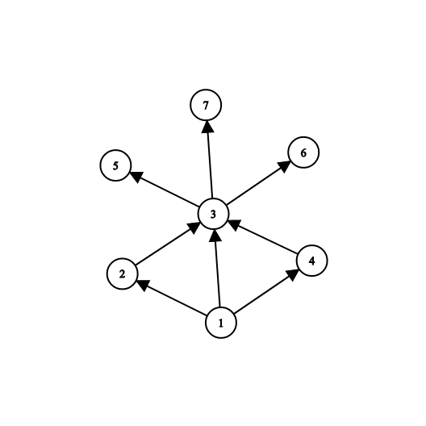

# Highest dependency

The problem is simplified to a directional graph.
each node in this graph represents a task.
and each edge in this graph shows a dependency between tasks.
The quest is to find the number of all dependent nodes.

For example, in the above picture node one depends on six other nodes